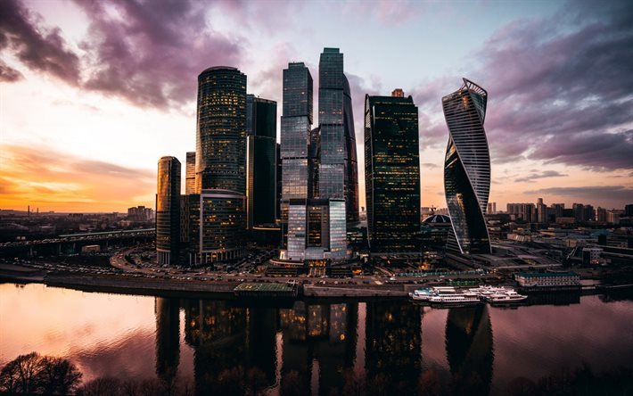
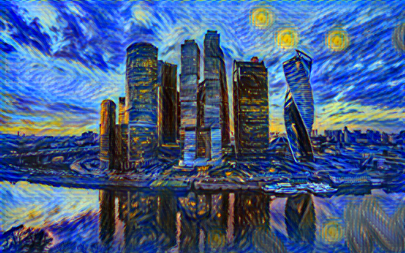
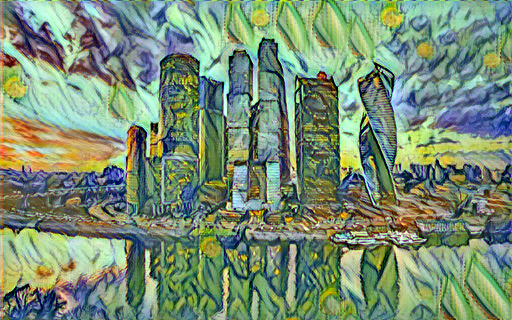
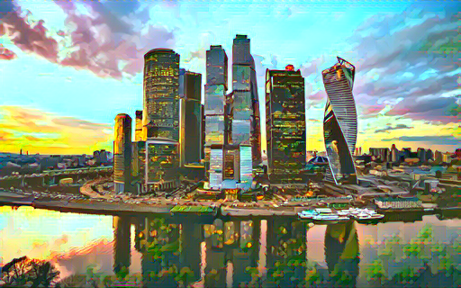
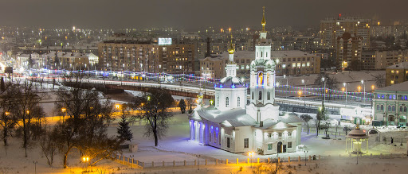
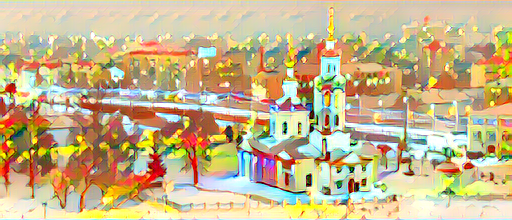

# Style transfer with catalyst

<div align="center">

[](https://github.com/catalyst-team/catalyst)

</div>

This repository shows experiment in realtime style transfer with catalyst deep learning framework. The experiment is based on article 
[Perceptual Losses for Real-Time Style Transfer and Super-Resolution](https://arxiv.org/abs/1603.08155)


## Examples

<div align="center">

<br>


</div>

<div align="center">


</div>


## Usage

1. **Install dependencies:** 
```pip3 install torch==1.6.0 catalyst==20.8.2 numpy tensorflow==2.0.0 tensorboard```
    ##### Attention: Catalyst don't have guaranteed backward compatibility, please use only specified version.

2. **Configure experiment:** \
Fill all fields marked by "{SPECIFY}" tag in config.yml

3. **Run training:** \
```catalyst-dl run --config config.yml --verbose``` \
Well recommendation is to install https://github.com/NVIDIA/apex and use more than one GPU. Catalyst provides multi-GPU and distributed training "out-the-box"

4. **Inference:** \
See ```infer_catalyst.py``` to find details.

5. **Ready models:** \
You can find weights for ```512x512 ImageTransformer``` in ```./models```
